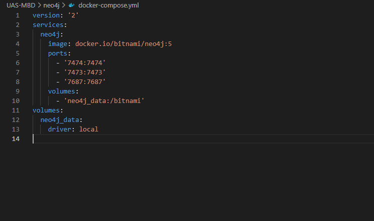
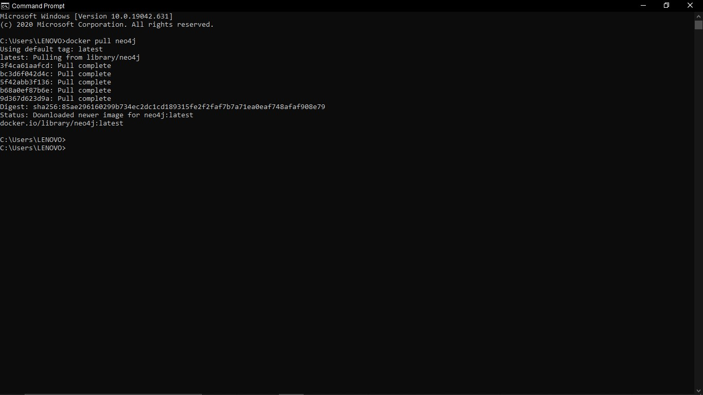
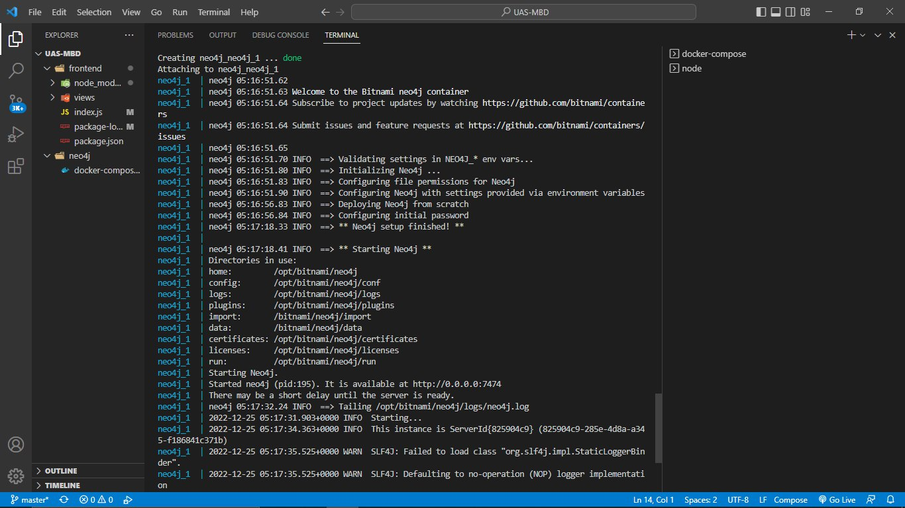

# UAS Manajemen Basis Data - Neo4j 

# >>> Neo4j setup <<<
### Menggunakan Docker
### 1. Buat folder baru ex. neo4j kemudian buat file dengan tipe .yml

### 2. Install Pull dari docker hub 

### 3. Install dengan docker-compose

### 4. Run Docker

### 5. Buat folder baru ex. neo4j kemudian buat file dengan tipe .yml

## Configuration

##

# >>> Neo4j integration <<<
## Connectivity
### Menggunakan neo4j driver

## Query (Using match)

## Create

## Update

## Delete

